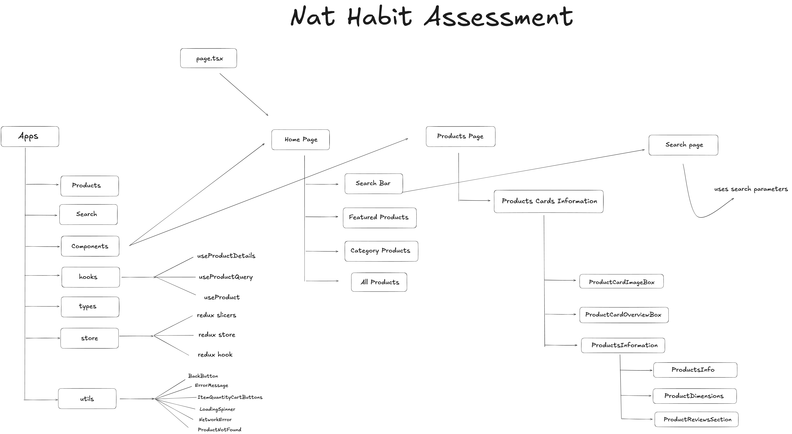

# Nat Habit Storefront – Project Overview & Architecture

This project is built with Next.js App Router and wrapped inside Redux Toolkit for global state management.

<div align="center">
  
  <p><em><a href="./public/architecture/nat-habit-assessment-architecture.svg">View High-Resolution Vector SVG Diagram</a></em></p>
</div>

At the root (`/`), the main entry file (`app/page.tsx`) renders the `HomePage` component. Inside `HomePage`, the layout flows through 5 major sections:

1. **Navbar** (with brand logo, mobile drawer, and interactive shopping cart badge)
2. **SearchBar**
3. **FeaturedProducts** (carousel slider)
4. **ProductCategories** (category filter buttons & sorting dropdown)
5. **AllProducts** (main product grid with pagination)

### Data Fetching & Redux Caching Approach
Since Redux Toolkit is used for state management, products fetched from the DummyJSON API are stored globally in Redux so we don't fetch duplicate data.

To make the code modular, I created a custom `useProducts` hook (`store/useProducts.ts`) that acts as the single source of truth for product data. Inside this hook, 3 types of fetching and querying are handled:
1. Fetching the entire product catalog (`fetchCatalog`)
2. Fetching/caching individual products by ID (`fetchProductById`)
3. Searching products by keyword (`searchProducts`)

---

### Homepage Component Walkthrough

* **SearchBar**: A search input component that lets users search for items. When submitted, it navigates to `/search?q=...` where `useSearchParams` and our query hook display the matching search results.
* **FeaturedProducts**: Uses an Ant Design `Carousel` to display top products in an auto-playing responsive slideshow. I also split each card into a modular `FeaturedProductSlide` subcomponent.
* **ProductCategories**: A clean filter bar showing category buttons along with a sorting dropdown (Price: Low to High, Price: High to Low, Highest Rated).
* **AllProducts**: The main product listing grid mapped from the `useProducts` hook. Each card is broken down into 3 subcomponents:
  * `ProductsCardTop` (product image thumbnail & discount badge)
  * `ProductsCardBottom` (price & star rating)
  * `ItemQuantityCartButtons` (Add to Cart / quantity controls)

---

### Product Detail Page (`/products/[id]`)

Whenever a user clicks on a product card, it navigates to dynamic route `/products/[id]`, which renders the `ProductsCardsInformation` component. This component checks Redux cache first so repeat visits load instantly with `0` API calls.

It is organized into the following sections:

1. **ProductCardImageBox** (left side image gallery & thumbnail selector)
2. **ProductCardOverviewBox** (right side product details like title, brand, description, star ratings, and warranty badges)
3. **ProductsInformation** (tabbed metadata section below the main overview box)
4. **Similar Category Products** (reusing the `AllProducts` grid filtered by the current product's category)

Inside **ProductsInformation**, the tabs are further divided into modular components:
* `ProductInfo`: Detailed shipping, return policy, and stock status.
* `ProductDimensions`: Product weight and physical dimensions box.
* `ProductReviewsSection`: Displays customer feedback and is composed of:
  * `ProductReviewsRating`: Overall rating and individual review comments.
  * `ProductReviewCustomerInfo`: Reviewer details like name, email, and date.

---

### Folder Structure & Organization

* **`util/`**: Contains reusable UI helpers and components like `LoadingSpinner`, `ErrorMessage`, `NetworkError`, `ProductNotFound`, and `BackButton`.
* **`types/`**: Contains `types.ts` with TypeScript interfaces for `Product`, `CartItem`, and component props.
* **`store/` & `ReduxSlicers/`**: Contains the Redux store configuration, custom hooks, `FetchProductDataSlicer` (catalog cache), and `CartSlicer` (shopping cart state).
* **`hooks/`**: Contains all custom hooks (`useProducts`, `useProductDetails`, `useProductQuery`).

---

### Extra Features Added (Beyond Basic Assignment Requirements)

1. **Full Shopping Cart Drawer**: Built interactive Add-to-Cart functionality with increment/decrement controls using Redux and Ant Design's Drawer component.
2. **Local Storage Cart Persistence**: Automatically saves cart state to `localStorage` so items and quantities persist across browser refreshes and page reloads.
3. **Client-Side Pagination**: Added smooth pagination on the Homepage product grid (`react-simple-pagination`) to display large catalog sets cleanly instead of endless scrolling.
4. **Interactive Sorting & Filtering**: Added category filter pills and multi-option sorting (*Price: Low to High*, *Price: High to Low*, *Highest Rated*) on the homepage.
5. **Similar / Recommended Products Grid**: Added a dedicated recommended products section at the bottom of single product detail pages based on matching category.
6. **Dynamic SEO & OpenGraph Tags**: Added dynamic page titles and meta descriptions (`app/products/[id]/layout.tsx` & SEO helpers) so every product page is SEO-friendly.
7. **Single-Fetch Redux Caching**: Designed intelligent caching in `useProducts` so once a product or catalog is fetched, navigating between pages loads instantly with zero extra API requests.

---

## Getting Started & Local Setup

### Prerequisites
- **Node.js**: v18.17.0 or higher
- **npm** or **yarn**

### 1. Install Dependencies
Clone the repository and install packages:
```bash
npm install --legacy-peer-deps
```

### 2. Run the Development Server
Start the local development server:
```bash
npm run dev
```
Open [http://localhost:3000](http://localhost:3000) in your browser to view the application.

### 3. Production Build
To test the optimized production bundle locally:
```bash
npm run build
npm run start
```